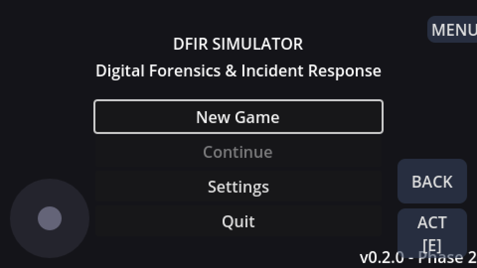
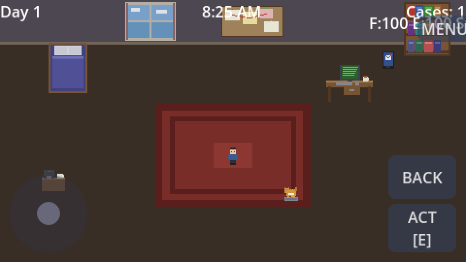

# DFIR Simulator

A top-down pixel art game where you play as a DFIR (Digital Forensics & Incident Response) consultant working from home. Investigate cyber incidents, analyze evidence in a real forensic terminal, pet your cat, and climb the career ladder from Intern to Director.

**[Play in Browser](https://jbeley.github.io/dfir-godot/)** | [Contributing](CONTRIBUTING.md) | [Security](SECURITY.md)



## Gameplay

You're a remote DFIR consultant. Your apartment is your office. Cases come in via email. You analyze evidence in a terminal using real forensic tool syntax, track IOCs, map ATT&CK techniques, build timelines, and submit reports for grading.



### The Terminal is King

24 commands with real forensic syntax, pipe support (`|`), and output redirection (`>`):

```
$ cat /evidence/logs/Security.evtx | grep "EventID>4625" | wc -l
6

$ hayabusa /evidence/logs/Security.evtx -l high
[CRITICAL] Audit Log Cleared | EventID 1102...
[HIGH] Suspicious PowerShell Execution | Invoke-Expression...

$ ioc add ip 194.36.189.21
IOC added: IP Address = 194.36.189.21

$ timeline add 2024-01-14T23:00 "Brute force attack begins from 194.36.189.21"
Timeline event added

$ technique add T1110.001
Technique mapped: T1110.001

$ submit
Grade: A (87/100)
IOC Accuracy:    90%
ATT&CK Mapping:  80%
Timeline:        85%
Timeliness:      95%
Reputation earned: +12.0
```

### Features

**Investigation Tools:**
- `grep`, `cat`, `head`, `tail`, `sed`, `awk`, `sort`, `uniq`, `wc`, `strings`, `hash`, `find`
- `plaso` - forensic timeline generation (background job)
- `hayabusa` - Windows Event Log analysis with 10 Sigma-like detection rules
- `dissect` - forensic artifact parser
- `ioc` - track indicators of compromise
- `timeline` - build incident timeline
- `technique` - map MITRE ATT&CK techniques
- `submit` - get scored on your investigation

**Campaign Mode:**
- 3-act story with interconnected arcs
- DarkLock ransomware gang escalating from small biz to hospitals
- Phantom Bear nation-state APT targeting defense contractors
- Corporate insider exfiltrating trade secrets
- Act 3: all three threats converge on one target

**Work From Home Life:**
- Manage Focus, Energy, and Stress stats
- Drink coffee, sleep, pet the cat
- Random interruptions: cat on keyboard, Slack pings, doorbell, ISP outages
- 7-tier career: Intern -> Junior -> Analyst -> Senior -> Principal -> Lead -> Director

**NPC Dialogue:**
- Branching conversations with client archetypes
- Panicked CEO ("Everything is encrypted!"), Lone IT Admin, Hostile Lawyer
- Your choices affect client trust and evidence access

**The Cat:**
- Wanders your apartment autonomously
- Sits on your keyboard and types gibberish
- Purrs when petted (reduces stress)
- Takes naps in random spots

## Tech Stack

- **Engine:** Godot 4.3 (GDScript, gl_compatibility renderer)
- **Resolution:** 480x270 base, 16-bit SNES-era pixel art
- **Targets:** Web (GitHub Pages), Steam Deck, Desktop
- **CI/CD:** Semgrep SAST, GDScript lint, Godot compile checks, TruffleHog, 95 unit tests
- **Audio:** Procedurally generated chiptune SFX and soundtrack
- **Art:** Procedurally generated pixel art sprites

## Play

### Browser
Visit **[jbeley.github.io/dfir-godot](https://jbeley.github.io/dfir-godot/)**

Touch controls appear automatically on mobile (joystick + action buttons).

### Local
1. Install [Godot 4.3+](https://godotengine.org/download)
2. Clone: `git clone https://github.com/jbeley/dfir-godot.git`
3. Open `project.godot` in Godot
4. Press F5

## Modding

Create custom case packs as JSON files in `user://case_packs/`:

```json
{
  "pack_info": {
    "name": "My Cases",
    "author": "you",
    "version": "1.0"
  },
  "cases": [{
    "title": "Cryptominer on Web Server",
    "severity": "MEDIUM",
    "deadline_hours": 24,
    "attack_techniques": ["T1190", "T1496"],
    "evidence": [{
      "name": "auth.log",
      "type": "linux_syslog",
      "path": "/evidence/logs/auth.log",
      "content": "Mar 10 02:15:33 web01 sshd..."
    }],
    "correct_iocs": [
      {"type": "ip", "value": "45.33.22.11"}
    ]
  }]
}
```

See [sample_pack.json](assets/data/case_packs/sample_pack.json) for a complete example.

## Project Structure

```
src/
  autoloads/        # 11 singletons (game state, audio, time, cases...)
  scenes/           # 9 game scenes (office, terminal, email, dialogue...)
  systems/          # Campaign, interruptions, scoring, tutorial, modding
  data/             # Case generators, sample cases, data models
  ui/               # Touch controls, shaders, components
assets/
  sprites/          # Pixel art (player, cat, furniture, NPC portraits)
  audio/            # Chiptune SFX + soundtrack
  data/             # Threat intel mirrors, dialogue, case packs
tools/
  generate_sprites.py     # Pixel art generator
  generate_sounds.py      # Chiptune SFX generator
  generate_music.py       # Soundtrack generator
  generate_portraits.py   # NPC portrait generator
  sync_threat_intel.py    # CISA KEV + MITRE ATT&CK sync
tests/              # 95 unit tests
```

## License

[MIT](LICENSE)
